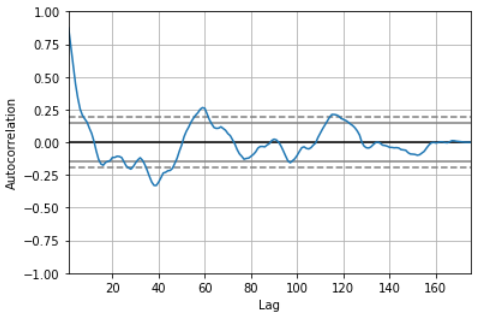
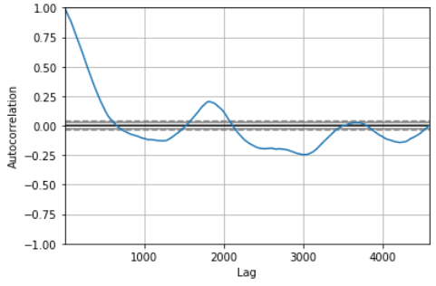

# Algo-Trading-Math-Models
## Math Techniques viz. ARIMA, Frequency Decomposition, Fourier Filtering, Linear Regression &amp;  Bi-directional LSTMs on Feature Engineered Stock Market Data.

**Quant Trading**
Quant strategies follow a data-driven approach to pick stocks. This approach  which seeks to reduce the role of human bias conceptually fall in between active and passive trading. The stock data is a classic example of " time series" where the prices are sampled at regular intervals.

**Fourier Filtering**

Fourier Filtering helps to de-noise the signal in order to find out the significant curve. This technique can be used before feeding the prediction model or even to smooth the model output.

**ARIMA Model on TCS Stock Data**

**Linear Regression**

**Frequency Decomposition using Power Spectral Density Curve**

**LSTM on S&P500 Time Series with Fourier Filering**

**References**
 
  [1] *Inversion Detection in Text Document Images. Hamid Pilevar, A. G. Ramakrishnan, Medical Intelligence and Language Engineering Lab, Department of Electrical Engineering, Indian Institute of Science, Bangalore (JCIS 2006)* 
  [2] *Shape Context: A new descriptor for shape matching and object recognition. Serge Belongie, Jitendra Malik and Jan Puzicha. Department of Electrical Engineering and Computer Sciences, University of California at Berkeley (NIPS 2000)* 
  [3] *Shape Matching and Object Recognition Using Shape Contexts. Serge Belongie, Jitendra Malik and Jan Puzicha. Computer Science Division, University of California at Berkeley (PAMI 2002)*
