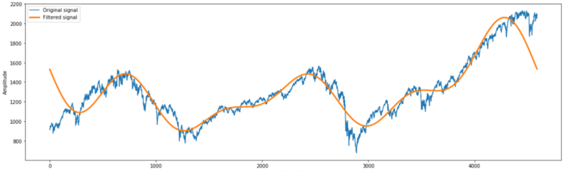
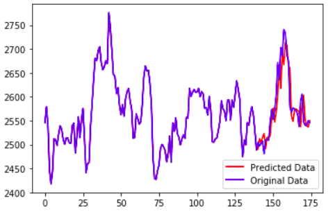
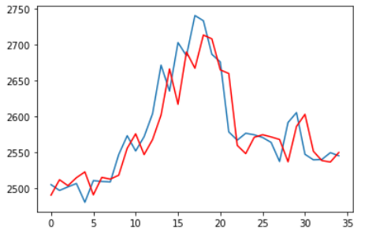
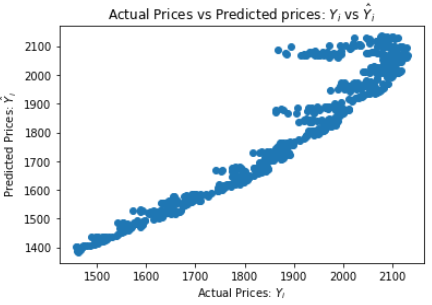
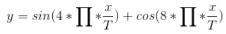
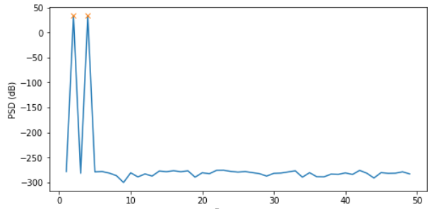
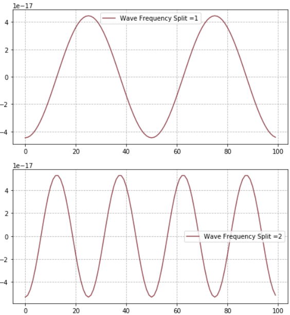
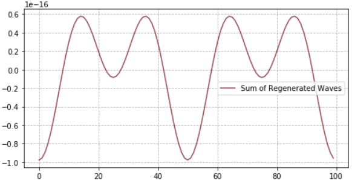
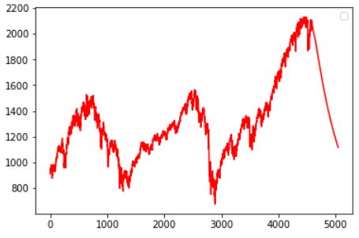
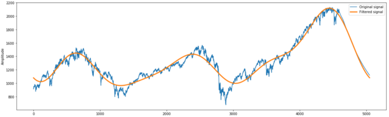

# Algo-Trading-Math-Models
## Math Techniques viz. ARIMA, Frequency Decomposition, Fourier Filtering, Linear Regression &amp;  Bi-directional LSTMs on Feature Engineered Stock Market Data.

**Quant Trading**
Quant strategies follow a data-driven approach to pick stocks. **This approach  which seeks to reduce the role of human bias conceptually fall in between active and passive trading.** The stock data is a classic example of " time series" where the prices are sampled at regular intervals.

**Fourier Filtering**

Fourier Filtering helps to **de-noise the signal** in order to find out the significant curve. This technique can be used before feeding the prediction model **or even to smooth the model output.**

**ARIMA Model on TCS Stock Data**

aka. Box-Jenkins model, ARIMA was created in 1976. It is conceptually similar to a linear regression model applied on time series data.   

**ARIMA has 3 parts:**
**- Auto Regression**
**- Integration (Differencing)**
**- Moving Average**

**Linear Regression** 

We were using **only 'p' previous values and 'q' errors to predict.** But we can use other features such as day of week, time of day, holidays etc. This technique, known as Feature Engineering is more of an art than science. 

Here we take a CSV file containing daily record of the price of the S&P500 Index from 1950 to 2015. Lets try to predict response variable, i.e. closing price, prior to a day. We can use features the features below:  
1) **Average Price** of past 365 days.
2) Ratio of average price for the past 5 days & past 365 days.
3) **Mean and Standard Deviation** of previous 365 days.

**Frequency Decomposition using Power Spectral Density Curve**  
Auto correlation is one way to compute periodicity. But a more scientific way to find periodicity is Fourier Transform. This technique can be used to find out the **most significant periodic changes in historical data,** which gives a dependable hint about future. 

**LSTM on S&P500 Time Series with Fourier Filering**
 
Long Short-Term Memory networks, can be used to learn from the series of past observations to predict the next value in the sequence.  
A vanilla LSTM model has a single hidden layer of LSTM units, and an output layer used to make prediction. Here we are working with a uni-variate series, so the number of features is one.  
**We apply LSTM on the same S&P 500 data taken for Fourier filtering.** First we draw the auto correlation graph to estimate the lag.   

We tried to model stock market behaviour using supervised learning approaches viz. Linear Regression or LSTM. But Reinforcement Learning is more robust to account for various environmental factors that affects stock market, as it aims to maximise reward in a given situation.

Fourier analysis works best with waves or wavelets that are regular and predictable, for which stock market is an antithesis. Hence it is beneficial to look into spectral analysis and signal extraction also.
